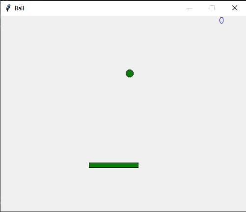

# Game_ball ⚾
## This is my first game 🎇

# To play my game you need:
- Install Python IDE (I recommend [PyCharm](https://www.jetbrains.com/ru-ru/pycharm/download/) or [IDLE Python](https://www.python.org/downloads)) 
- Install tkiter librery
   + To install this librery write:
   ```
   pip install tkinter
   ```
- Clone this [git-repository](https://github.com/Abdusharif0095/Game_ball) with command below:
   ```
   git clone https://github.com/Abdusharif0095/Game_ball
   ```
- Run the ball.py with command below:
  ```
  python ball.py
  ```
 - Now you can play 
 
## You can see my game here <br>


# In this game you can choose colors:
+ Ball
+ Paddle
+ Score
### To do this, you need to open ball.py and inject colors into these variables:

# Thank you for your attention to my project!!!
# Good Luck!!!
